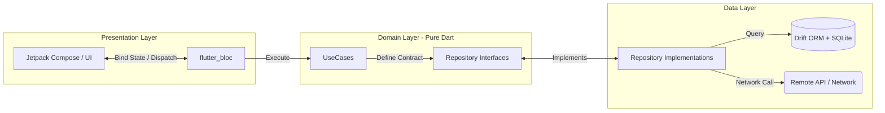

# System Architecture & Tech Stack

## 1. Core Tech Stack & Specifications

| Component                | Technology       | Responsibility                                                                           |
|:-------------------------|:-----------------|:-----------------------------------------------------------------------------------------|
| **State Management**     | `flutter_bloc`   | Handles UI events, encapsulates business states, manages screen side-effects.            |
| **Dependency Injection** | `GetIt`          | Service locator used for explicit dependency registration during app initialization.     |
| **Local Persistence**    | `Drift` (SQLite) | Reactive local storage, handles offline-first data caching and atomic upsert operations. |
| **Rich Text Engine**     | `flutter_quill`  | Manages document/task state via JSON Delta format.                                       |

## 2. Directory Structure & Layer Boundaries

- **`lib/domain/`**: Core business logic. Contains pure Dart models, use cases, and repository definitions.
    - *Rule:* Zero dependencies on Flutter, Drift, or network libraries.
- **`lib/data/`**: Infrastructure and data management. Realizes repository contracts, manages Drift database migrations, handling network serialization (`toMap`/`fromMap`).
- **`lib/ui/`**: Presentation layer. Divided into feature-centric folders containing Blocs, Screens, and custom atomic design widgets.
- **`lib/di/`**: Centralized dependency injection via `GetIt` (`service_locator.dart`).

## 3. High-Level Data Flow
The application strictly enforces a Unidirectional Data Flow (UDF) pattern across three isolated layers.

