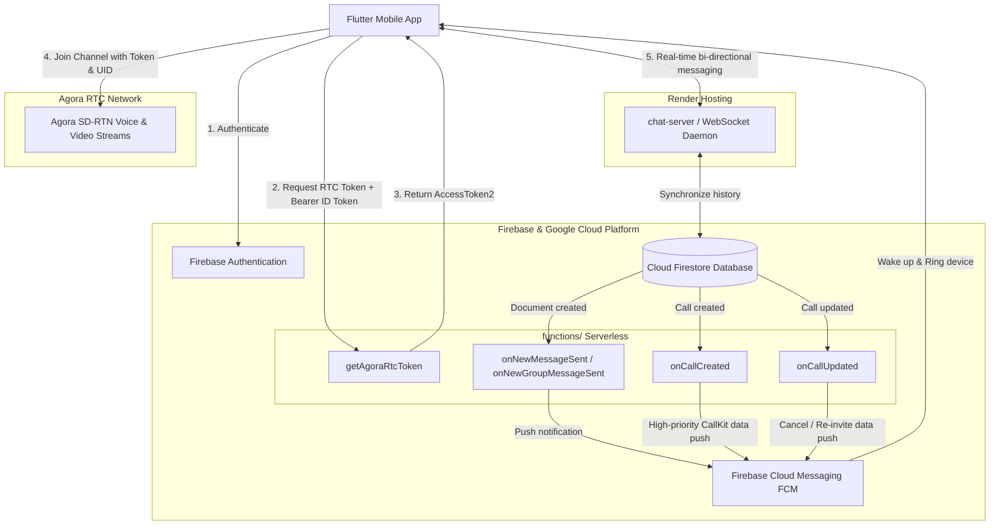

# Backend Services Architecture: `chat-server` & `functions`

## 1. Overview & Service Responsibilities

The CollabTasks backend infrastructure consists of two distinct external components:
1. **`chat-server/`** — A persistent WebSocket service hosted on **Render**.
2. **`functions/`** — A serverless **Firebase Cloud Functions** suite running in **Google Cloud**.

| Service | Hosting Platform | Tech Stack | Primary Responsibilities |
| :--- | :--- | :--- | :--- |
| **`chat-server/`** | **Render** | Node.js, TypeScript, `ws`, Express | Real-time bi-directional messaging, live group chat synchronization, typing indicators, and presence while the app is active in foreground. |
| **`functions/`** | **Firebase Cloud Functions** (Google Cloud) | Node.js 24, TypeScript, `firebase-admin`, `agora-token` | 1) Secure Agora RTC token minting. 2) Background & lock-screen push notifications via FCM for messages and incoming CallKit calls. 3) Reactive Firestore document triggers. |

---

## 2. Deep Dive: `functions/` (Firebase Cloud Functions)

Located in `functions/src/index.ts`. Contains five Cloud Functions:

### 2.1 Agora Security & RTC Token Issuer
* **`getAgoraRtcToken`** (`onRequest` — HTTPS API):
  * **Endpoint:** `POST https://us-central1-collabtasks-fda3f.cloudfunctions.net/getAgoraRtcToken`
  * **Security:** Validates the caller's Firebase Auth ID Token (`Authorization: Bearer <idToken>`).
  * **Function:** Securely mints Agora RTC `AccessToken2` tokens using `agora-token` (`RtcTokenBuilder.buildTokenWithUid`). The confidential `AGORA_APP_CERTIFICATE` is stored exclusively in server environment variables and is never exposed to client applications.

### 2.2 Firestore Database Triggers & FCM Push Notifications
* **`onNewMessageSent`** (`onDocumentCreated("chats/{chatId}/messages/{messageId}")`):
  * Fires when a new direct message document is written to Firestore.
  * Resolves the recipient's FCM registration tokens from `users/{recipientId}`.
  * Dispatches an FCM notification to display banner/sound alerts on backgrounded or locked devices.
* **`onNewGroupMessageSent`** (`onDocumentCreated("group_chats/{chatId}/messages/{messageId}")`):
  * Fires when a message is added to a group chat.
  * Collects FCM tokens of all group participants (excluding the sender).
  * Dispatches grouped notification payloads (`title: groupTitle`, `body: "Sender: Message"`).
* **`onCallCreated`** (`onDocumentCreated("calls/{callId}")`):
  * Fires on the creation of 1-to-1 or group call documents.
  * Resolves recipient FCM tokens for all `calleeIds`.
  * Sends high-priority data-only pushes (`action: "incoming_call"`).
  * Wakes up sleeping devices and triggers the native **FlutterCallkitIncoming** UI with ringtone, vibration, and full-screen intent.
* **`onCallUpdated`** (`onDocumentUpdated("calls/{callId}")`):
  * **Call Cancellation (`action: "cancel_call"`):** When a call transitions to `cancelled`, `rejected`, or `ended`, dispatches a background push to dismiss the CallKit ringing screen on remote devices.
  * **Dynamic Group Re-invite:** Detects when participants are re-invited or their status returns to `ringing`, dispatching an `incoming_call` push so previously offline or invited devices ring.

---

## 3. Deep Dive: `chat-server/` (Render WebSocket Server)

Located in `chat-server/`:
* Runs an HTTP/WebSocket daemon listening on a dedicated port.
* Maintains persistent WebSocket connections with active client apps.
* Handles:
  * Low-latency message delivery for open chat screens.
  * Real-time read receipts and message delivery statuses.
  * Presence tracking (online/offline).
  * Group chat metadata synchronization.

---

## 4. End-to-End Architecture & Interaction Flow

