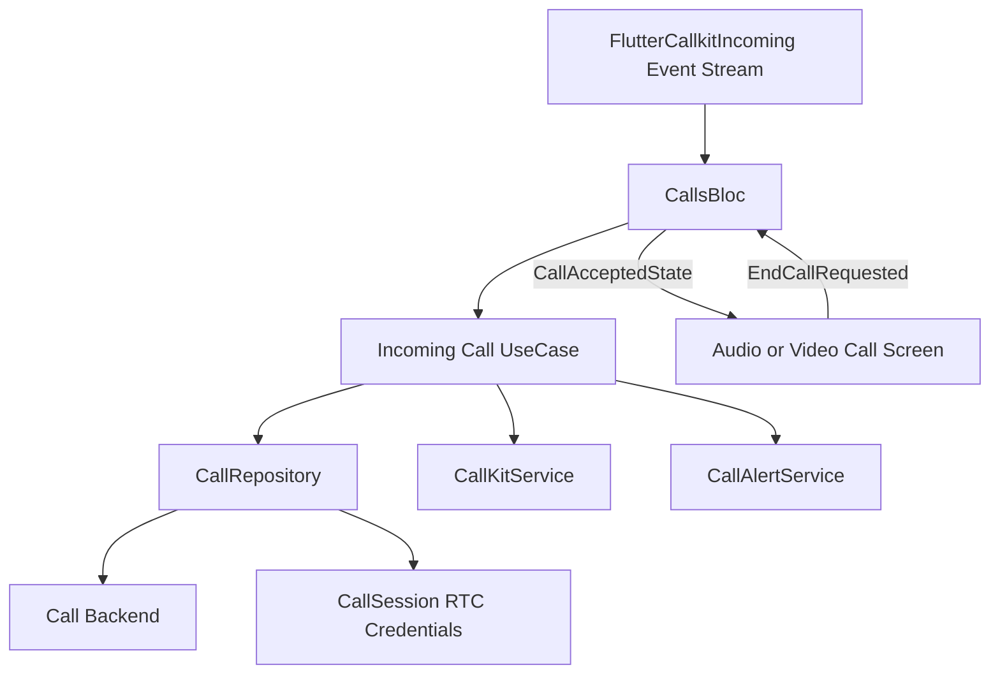

# Feature: Calls

## 1. Business Goal & Value
- **Purpose:** Process native incoming-call actions and prepare RTC session data.
- **User Stories Covered:** Accept, decline, and cancel incoming calls from the CallKit interface.

## 2. Architectural Blueprint (Clean Architecture)

### Domain Layer
- **Models:** `CallDataEntity` contains the CallKit and RTC fields supplied by the incoming-call payload.
- **Use Cases:**
    - `AcceptIncomingCallUseCase` accepts a call, dismisses the native screen, and returns a `CallSession`.
    - `DeclineIncomingCallUseCase` rejects the call and stops call alerts and the native screen.
    - `CancelIncomingCallUseCase` stops call alerts and dismisses the native screen.
- **Bloc Events and States:** `CallKitEventReceived` forwards native plugin events to `CallsBloc`; `CallAcceptedState` carries the call payload and RTC session, and `CallEndedState` clears the active call state. Both CallKit and in-app acceptance stop alerts and use the app-level accepted-call listener for navigation; an open incoming dialog is dismissed before routing.
- **Navigation and Restore:** The app routes accepted calls to the audio or video screen. On authentication and app resume it refreshes the local preferences cache before restoring accepted-call payloads written by CallKit's background isolate, then checks `FlutterCallkitIncoming.activeCalls()` as a fallback. Killed-app callbacks also dispatch Accept through an in-process stream; pending CallKit accepts suppress the matching Firestore incoming dialog and wait for the recipient ID before processing. Android's main Flutter activity uses `singleTop` so CallKit's accept intent can be delivered to the existing app activity.
- **Repository Interface:** `CallRepository` accepts/rejects calls and supplies RTC session credentials.

### Data Layer
- **Remote Data:** `CallRepository` implementation sends accept/reject requests to the configured backend.
- **Native Integration:** `CallKitService` abstracts the platform call UI; `CallKitServiceImpl` uses `flutter_callkit_incoming`.
- **Push Payload:** The FCM background handler accepts `incoming_call` and `cancel_call` in either the `action` or `type` field. Incoming call messages include the target `calleeId`, allowing a background decline to reject the correct call participant. The foreground notification listener ignores call messages; the app's incoming-call UI remains the foreground control surface.
- **CallKit Actions:** A background CallKit event handler persists Accept actions for app startup and applies Decline to Firestore. Accepted CallKit calls subscribe to Firestore updates so a remote hangup ends local RTC state. Terminal call status changes (`cancelled`, `rejected`, or `ended`) send cancellation pushes even after the call became active; the client dismisses the native ongoing-call notification and clears matching call state. Resolving Accept, Decline, timeout, or end suppresses stale Firestore snapshots from reopening the same incoming-call dialog. Call dismissal also clears the Android incoming notification and ringing audio.

### Presentation Layer (UI & Bloc)
- **Native Actions:** Use cases can be called from native CallKit action callbacks without requiring the in-app call UI.

## 3. Testing Matrix
- [ ] **Unit:** Verify repository calls, RTC session result, alert stop, and CallKit dismissal.

## 4. Data Flow & State Machine (Mermaid)

