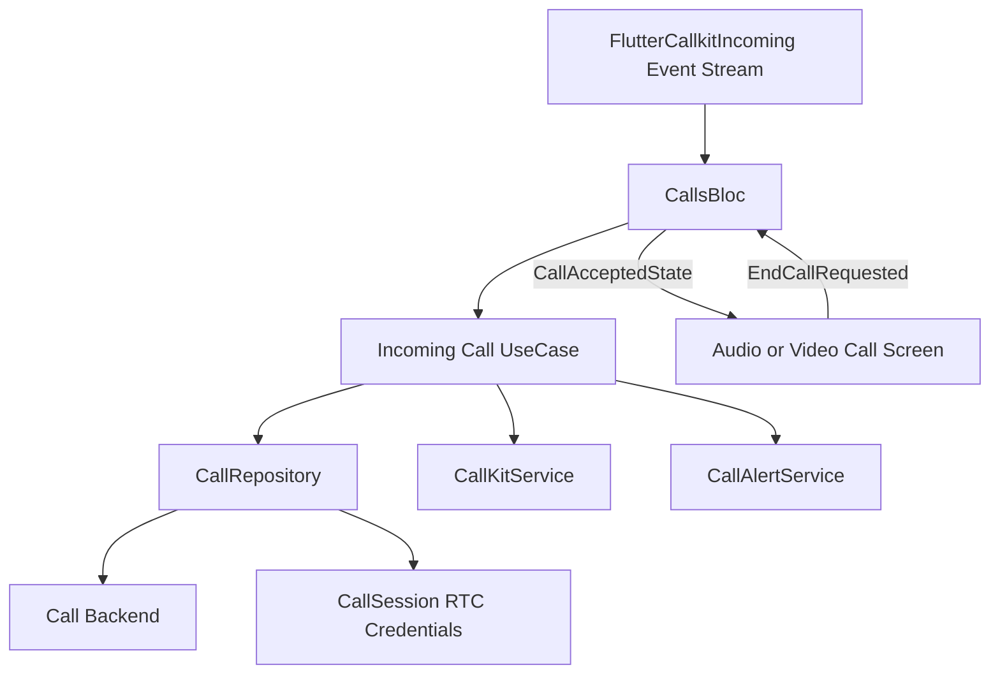

# Feature: Calls

## 1. Business Goal & Value
- **Purpose:** Process native incoming-call actions and prepare RTC session data.
- **User Stories Covered:** Accept, decline, and cancel incoming calls from the CallKit interface.

## 2. Architectural Blueprint (Clean Architecture)

### Domain Layer
- **Models:** `CallDataEntity` contains the CallKit and RTC fields supplied by the incoming-call payload.
- **Use Cases:**
    - `AcceptIncomingCallUseCase` accepts a call, dismisses the native screen, and returns a `CallSession`.
    - `DeclineIncomingCallUseCase` rejects the call and stops call alerts and the native screen.
    - `CancelIncomingCallUseCase` stops call alerts and dismisses the native screen.
- **Bloc Events and States:** `CallKitEventReceived` forwards native plugin events to `CallsBloc`; `CallAcceptedState` carries the call payload and RTC session, and `CallEndedState` clears the active call state while retaining the authenticated recipient identity for the next call. That identity is cleared when incoming-call listening stops on logout. Both CallKit and in-app acceptance stop alerts and use the app-level accepted-call listener for navigation; an open incoming dialog is dismissed before routing.
- **Navigation and Restore:** The app restores persisted CallKit actions before starting the Firestore incoming-call listener. Pending accept IDs remain suppressed while queued events drain, preventing a Firestore snapshot from opening a duplicate dialog. The in-app incoming dialog is shown only while the app is resumed; while backgrounded, incoming UI belongs to CallKit. `CallAcceptedState` routes through the root navigator once per call ID; the app also rechecks the current accepted state after restoration and resume in case the state was emitted before the navigation listener was ready. On app resume it refreshes preferences and checks `FlutterCallkitIncoming.activeCalls()` as a fallback. Android's main Flutter activity uses `singleTop` so CallKit's accept intent can be delivered to the existing app activity.
- **Repository Interface:** `CallRepository` accepts/rejects calls and supplies RTC session credentials.

### Data Layer
- **Remote Data:** `CallRepository` implementation sends accept/reject requests to the configured backend.
- **Native Integration:** `CallKitService` abstracts the platform call UI; `CallKitServiceImpl` uses the local `packages/flutter_callkit_incoming` fork. On Android, the lock-screen activity listens for a package-scoped end broadcast; the intent must not target the Activity component, or the dynamic receiver will not receive the request to finish.
- **Push Payload:** The FCM background handler accepts `incoming_call` and `cancel_call` in either the `action` or `type` field. It registers the CallKit action callback in the FCM-started process before presenting an incoming call, so native Decline can reach Dart even when Android had to recreate the process. Incoming call messages include the target `calleeId`, allowing a background decline to reject the correct call participant. The handler logs message receipt and CallKit presentation under `[FCMCall]`; Cloud Function `onCallCreated` logs recipient-token counts and per-send FCM errors. The foreground notification listener ignores call messages; the app's incoming-call UI remains the foreground control surface.
- **CallKit Actions:** A background CallKit event handler persists Accept actions and queues Decline for retry if its Firestore write fails. A native Decline uses the recipient ID from the call payload if app authentication state is not yet restored, so the Firestore rejection does not wait for Bloc identity initialization. Decline cleanup still dismisses native UI and stops ringing when the remote write fails. Accepted CallKit calls subscribe to Firestore updates so a remote hangup ends local RTC state. Terminal call status changes (`cancelled`, `rejected`, or `ended`) send cancellation pushes even after the call became active; the client dismisses the native ongoing-call notification and clears matching call state. Call dismissal also clears the Android incoming notification and ringing audio.
- **Rejected outgoing calls:** When Firestore reports `rejected`, the caller cleans up the call and returns `CallsBloc` to `idle` while preserving the authenticated user ID. The outgoing call screen closes, and the persistent incoming-call listener can accept the next call without requiring the app to background or restart.
- **Group Calls & Dynamic Invitations:** When initiating a group call from a group chat, all group participants (excluding the caller) are passed as `calleeIds`. Participant addressing is strictly email-based (`e.contains('@')`), filtering out any internal UUIDs or duplicate records. The group call host immediately joins Agora RTC session and transitions `CallsStatus` to `active`, bypassing the 1-to-1 outgoing dial tone and 45-second timeout. Incoming call streams monitor both `ringing` calls and `active` calls where the user has been invited. When a participant leaves a group call (`leaveCall`), they are removed from `calleeIds` and their participant status changes to `left`; `GroupCallScreen` filters out participants with `left` or `declined` status so only actively participating users are rendered in the grid and count. When an existing or previously left participant is re-invited (`inviteParticipant`), their status is set back to `ringing` and they are re-added to `calleeIds`. Cloud Function `onCallUpdated` detects both new `calleeIds` and participants whose status transitioned to `ringing`, dispatching `incoming_call` FCM data pushes to wake up backgrounded/locked devices. `CallsBloc` clears prior resolution flags for active calls with ringing participants, allowing re-invited devices to present the incoming call dialog and rejoin the call. `CallAcceptedState` retains `activeCall` state so group call screens display the full participant grid with email identifiers and call duration timer.
- **Agora Video Streaming & Group UID Synchronization:** For video calls, `AgoraRtcService` applies mobile-optimized video encoder configurations (`640x360 @ 15fps, 600 kbps`) and enables dual-stream mode upon session start, preventing network congestion drops on Agora free tier. All call participant numeric UIDs are pre-calculated by `FirestoreCallRepository.getCallSession` and registered into `AgoraUidMapper` at session entry. `GroupCallScreen` matches media states by both primary `userId` and deterministic `user_$uid` fallbacks. Event handlers for `onRemoteVideoStateChanged` and `onFirstRemoteVideoDecoded` ensure `isVideoEnabled` stays synchronized with actual video frames, while `AgoraVideoViewFactory` preserves `VideoViewController` across periodic timer and volume rebuilds to prevent native texture tearing.

### Presentation Layer (UI & Bloc)
- **Native Actions:** Use cases can be called from native CallKit action callbacks without requiring the in-app call UI.
- **Responsive Group Call Grid & Controls:** `GroupCallScreen` renders 1-2 participants in single-column layout and switches to a 2-column `GridView` for 3+ participants. Grid cells responsively scale avatar radius, text sizes, and padding depending on column count. Participant name tags wrap in an `Expanded` container with `TextOverflow.ellipsis`, ensuring long email addresses and suffixes (`(You)`, `(Calling...)`) never trigger `RenderFlex` overflows. For ringing participants, a prominent status badge with spinner renders below the center avatar. The bottom controls bar uses an evenly-spaced full-width row with compact padding, ensuring comfortable button distribution across the entire screen width without unwanted margins.
- **Feature Localization (l10n/i18n):** All presentation layer components (`IncomingCallDialog`, `AudioCallScreen`, `VideoCallScreen`, `GroupCallScreen`) strictly consume localized text from `AppLocalizations` across English (`en`), Russian (`ru`), and Ukrainian (`uk`). Localized strings cover incoming call alerts, call and RTC connection states (`calling`, `ringing`, `connecting`, `reconnecting`, `failed`, `disconnected`), action tooltips and buttons (`mute`/`unmute`, camera toggles, switch camera, speaker, end call, leave call, end for all), invitation dialog fields, and participant badges. Business logic in `domain` and `data` remains strictly separated without any UI or localization coupling.

## 3. Testing Matrix
- [ ] **Unit:** Verify repository calls, RTC session result, alert stop, and CallKit dismissal.

## 4. Data Flow & State Machine (Mermaid)

