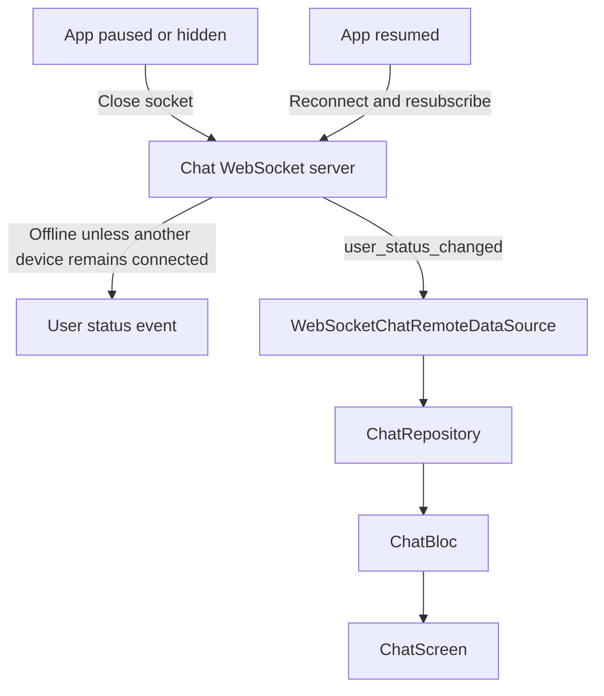

# Feature: ChatPresence

## 1. Business Goal & Value
- **Purpose:** Reflect direct-chat presence from authenticated WebSocket connections and report offline promptly when the app enters the background.
- **User Stories Covered:** Show online/offline status and last-seen information for direct-chat participants.

## 2. Architectural Blueprint (Clean Architecture)

### Domain Layer
- **Models:** `UserStatusEntity` contains user ID, status, and optional last-seen timestamp.
- **Use Cases:** `WatchUserStatusUseCase` exposes presence updates for the selected chat participant.
- **Repository Interface:** `ChatRepository` exposes a user-status stream.

### Data Layer
- **Remote Data:** `WebSocketChatRemoteDataSource` closes its socket on `paused`/`hidden` and reconnects and resubscribes on `resumed`. The chat server keeps an account online while any authenticated device connection remains.
- **Data Mappers:** `WsUserStatusDto` maps server `user_status_changed` events to `UserStatusEntity`.

### Presentation Layer (UI & Bloc)
- **Bloc / Cubit:** `ChatBloc` listens to the opponent's status stream and updates the loaded chat state.
- **Components & Screens:** `ChatScreen` renders online status or last-seen time.

## 3. Testing Matrix
- [ ] **Unit:** Verify websocket close on background and reconnect/resubscribe on resume.
- [ ] **Bloc:** Verify presence events update the active chat state.

## 4. Data Flow & State Machine (Mermaid)

