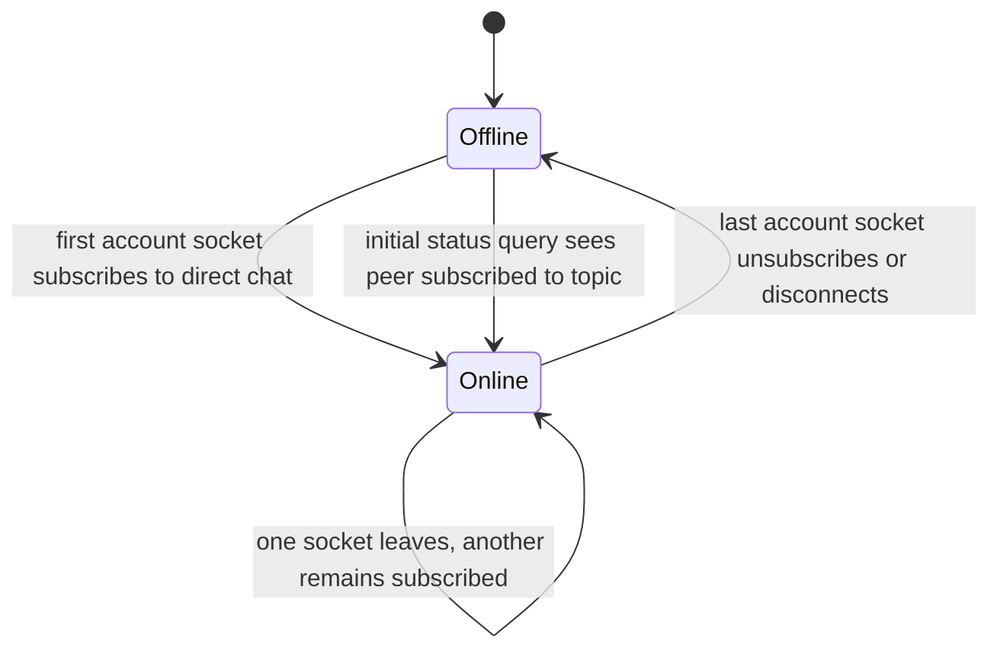

# Feature: Chat Presence

## 1. Business Goal & Value
- **Purpose:** Keep the direct-chat online indicator scoped to active subscriptions to that chat. A general authenticated WebSocket connection, including FCM-token synchronization, does not imply that the user is present in a chat.
- **User Stories Covered:** Show a peer as online while at least one of their devices is subscribed to the direct-chat topic; show offline and last seen after the last device leaves or disconnects from that topic.

## 2. Architectural Blueprint (Clean Architecture)

### Domain Layer
- **Models:** `UserStatusEntity` represents `online` or `offline`, with an optional last-seen timestamp.
- **Use Cases:** `WatchUserStatusUseCase` exposes status changes for a peer.
- **Repository Interface:** `ChatRepository.watchUserStatus(userId)` provides the peer's status stream.

### Data Layer
- **Local Persistence (Drift):** None.
- **Data Mappers:** `WsUserStatusDto` maps server events to `UserStatusEntity`.
- **Remote Data:** The WebSocket server emits `user_status_changed` when the first account socket joins a chat topic, when the last account socket leaves it, or when an initial topic subscription requests the peer's current status. Socket authentication and FCM token synchronization do not broadcast chat presence. Last-seen timestamps are persisted when the last topic subscription ends.

### Presentation Layer (UI & Bloc)
- **Bloc / Cubit:** `ChatBloc` subscribes to the peer status stream and emits `UserStatusUpdated`.
- **Events:** `UserStatusUpdated` carries the latest mapped server status.
- **States:** `ChatLoaded.opponentStatus` drives the header indicator.
- **Components & Screens:** `ChatScreen` displays the online marker or last-seen time.

## 3. Testing Matrix
- [ ] **Unit:** Verify topic presence transitions for subscribe, unsubscribe, disconnect, and multiple devices.
- [ ] **Bloc:** Verify peer status events update `ChatLoaded.opponentStatus`.
- [ ] **Widget:** Verify online and last-seen header rendering.

## 4. Data Flow & State Machine (Mermaid)

