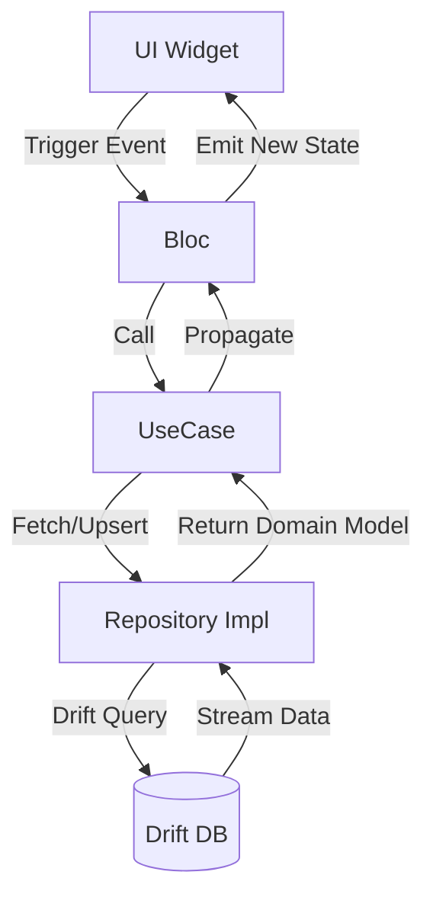

# Feature: [Feature Name in UpperCamelCase]

## 1. Business Goal & Value
- **Purpose:** [Short technical description of what this feature solves]
- **User Stories Covered:** [Brief list of tech requirements]

## 2. Architectural Blueprint (Clean Architecture)

### Domain Layer
- **Models:**
    - `[FeatureName]Model` (Fields, immutability, copyWith)
- **Use Cases:**
    - `[Action][Target]UseCase` -> [Brief description of inputs/outputs]
- **Repository Interface:**
    - `I[FeatureName]Repository` -> [Contract methods]

### Data Layer
- **Local Persistence (Drift):** [Tables, Dao or entities involved. Note if migration is needed]
- **Data Mappers:** [Entity to Domain Model mapping logic]
- **Remote Data (if applicable):** [API contracts or local data source logic]

### Presentation Layer (UI & Bloc)
- **Bloc / Cubit:** `[FeatureName]Bloc`
    - **Events:** `[FeatureName]Event` (List expected events)
    - **States:** `[FeatureName]State` (Initial, Loading, Success, Error with TaskErrorType)
- **Components & Screens:**
    - `[FeatureName]Screen` -> Main entry point
    - `[FeatureName]Dialog` -> [If modal UI state is needed, specify QuillController ownership if rich text is used]

## 3. Testing Matrix
- [ ] **Unit:** Test UseCase interactions and Repository exception propagation.
- [ ] **Bloc:** Test `blocTest` state transitions (Seed state -> Event -> Expect states).
- [ ] **Widget:** Verify UI rendering and DI reinitialization setup.

## 4. Data Flow & State Machine (Mermaid)
